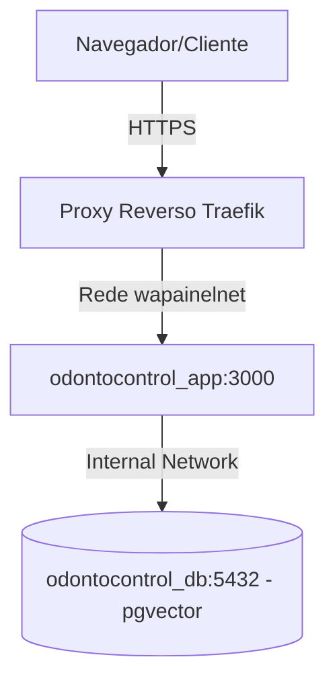

# Guia de Deploy - Docker Swarm & Portainer

Este documento orienta os desenvolvedores e engenheiros de DevOps sobre como compilar, empacotar, distribuir e publicar o projeto **OdontoControl** em um cluster **Docker Swarm** gerenciado via **Portainer**.

---

## 1. Variáveis de Ambiente Necessárias

Antes do deploy, prepare os valores das seguintes variáveis no ambiente ou no painel do Portainer (Stack Environment Variables):

| Variável | Descrição | Exemplo / Padrão |
| :--- | :--- | :--- |
| `APP_VERSION` | Tag/Versão da imagem Docker do app | `v0.1.0` (padrão: `latest`) |
| `DB_PASSWORD` | Senha do banco PostgreSQL com pgvector | *Definir uma senha forte* |
| `SUPABASE_URL` | Endpoint da API do Supabase (Auth/Transição) | `https://example.supabase.co` |
| `SUPABASE_PUBLISHABLE_KEY` | Chave anônima pública do Supabase | *Obtida no painel do Supabase* |
| `SUPABASE_SERVICE_ROLE_KEY` | Chave privada administrativa do Supabase | *Usada apenas no backend do app* |

---

## 2. Compilação e Envio da Imagem Docker

Certifique-se de executar os comandos a partir da raiz do repositório.

### Passo 1: Build local da imagem
Substitua `v0.1.0` pela versão correspondente:
```bash
docker build -t williamwilmer10/odontocontrol:v0.1.0 .
```

### Passo 2: Login no Docker Hub (ou registro privado)
```bash
docker login
```

### Passo 3: Envio da imagem (Push)
```bash
docker push williamwilmer10/odontocontrol:v0.1.0
```

---

## 3. Implantação no Portainer (Docker Swarm)

A stack utiliza o arquivo de configuração localizado em [deploy/portainer-stack.yml](file:///i:/odontocontrol/deploy/portainer-stack.yml).

### Requisitos de Rede Overlay
A stack espera a existência de uma rede externa chamada `wapainelnet`, que é a rede de comunicação com o reverse proxy Traefik.
Se a rede ainda não existir no Swarm, crie-a antes com:
```bash
docker network create --driver=overlay wapainelnet
```

### Passos no Portainer:
1. Acesse o painel do **Portainer** e selecione a seção **Stacks**.
2. Clique em **Add stack**.
3. Defina o nome como `odontocontrol`.
4. Em **Build method**, escolha **Web editor** ou faça upload do arquivo `deploy/portainer-stack.yml`.
5. Preencha as variáveis de ambiente na seção **Environment variables** (conforme a tabela do item 1).
6. Ajuste a URL do domínio nas labels do Traefik no YAML (ex: substitua `odontocontrol.seudominio.com.br` pelo seu domínio real).
7. Clique em **Deploy the stack**.

---

## 4. Arquitetura da Stack e Roteamento



* **Traefik Integration:** O serviço `odontocontrol_app` possui labels que informam ao Traefik para gerar certificados SSL automáticos via Let's Encrypt e direcionar o tráfego da porta `80/443` do host para a porta interna `3000` do container Node.js.
* **Volumes do Banco:** O volume `odontocontrol_db_data` é persistente e mantém os dados do PostgreSQL seguros mesmo em caso de reinicialização ou atualização do serviço do banco de dados.

---

## 5. Checklist Pós-Deploy

* [ ] **Acesso HTTP/HTTPS:** Abra o domínio configurado no navegador e certifique-se de que a aplicação carrega corretamente (sem erros 502/504).
* [ ] **Autenticação:** Tente fazer login em um ambiente de homologação para verificar se o app consegue se conectar ao Supabase Auth.
* [ ] **Conexão com o Banco Postgres:** Verifique os logs do container do app no Portainer para certificar-se de que ele conectou corretamente ao PostgreSQL (caso a integração Postgres esteja ativada).
* [ ] **Políticas de Backup:** Certifique-se de configurar rotinas de backup para o volume persistente do banco Postgres no host do Swarm.
